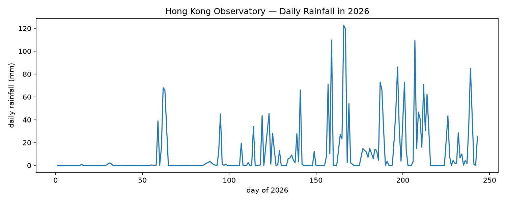

# Hong Kong Rainfall



## The phenomenon

Rainfall in Hong Kong changes significantly from day to day. Some days have no measurable rainfall, while other days can receive a large amount of rain. I chose rainfall because it is a familiar part of everyday life in Hong Kong and because changes in rainfall can be clearly represented through numbers. I wanted to see how a simple sequence of daily measurements could become a visual pattern.

The dataset records daily total rainfall at the Hong Kong Observatory in 2026. By plotting the values in chronological order, I can see when rainfall increases, decreases, or reaches a particularly high level. This makes the invisible pattern of rainfall easier to notice than reading the numbers in a table.

## The source

The data comes from the Hong Kong Observatory's open data service:

https://data.weather.gov.hk/weatherAPI/cis/csvfile/HKO/2026/daily_HKO_RF_2026.csv

The file contains 243 data rows. Each row represents one day and records the year, month, day, daily total rainfall, and data completeness. Rainfall is measured in millimetres (mm).

## What the picture shows

The picture shows daily total rainfall as a line across the available days of 2026. Higher points represent days with more rainfall, while points at zero represent days without measurable rainfall. The line makes changes and peaks in rainfall easier to see as a continuous pattern.

The picture hides some information from the original dataset. It does not show the data completeness field, the exact calendar dates as labels, or the original text values and source formatting. It also skips values recorded as "Trace" or missing values, so the picture does not represent every original entry.

## Run it

```text
uv run fetch.py
uv run plot.py
```
